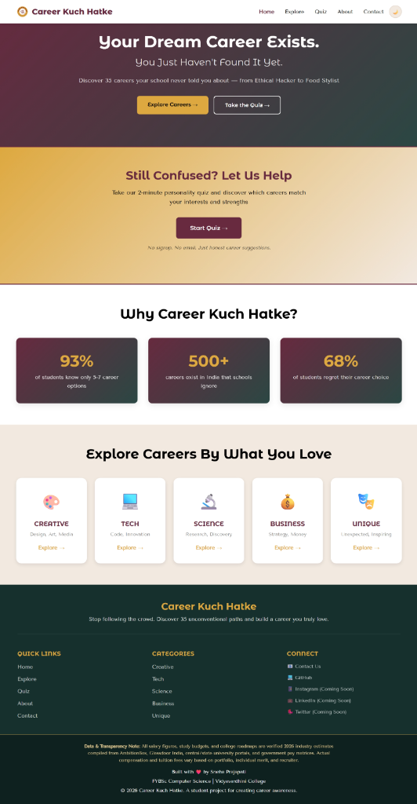
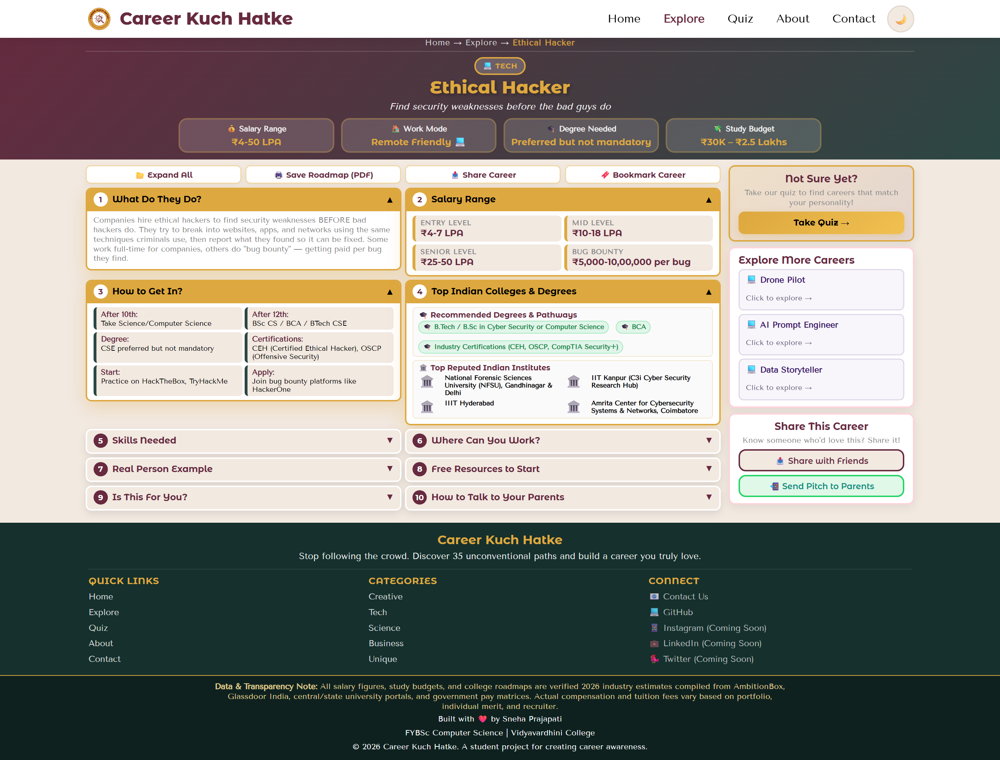
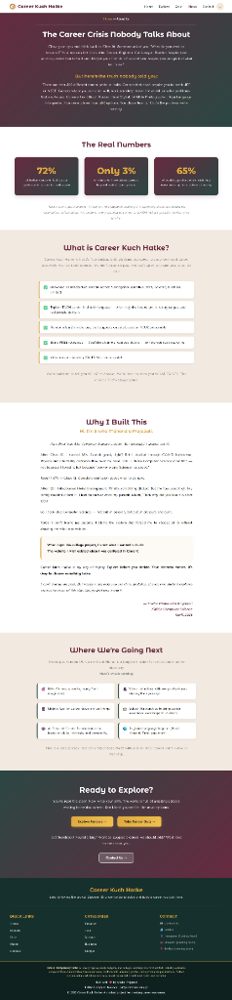
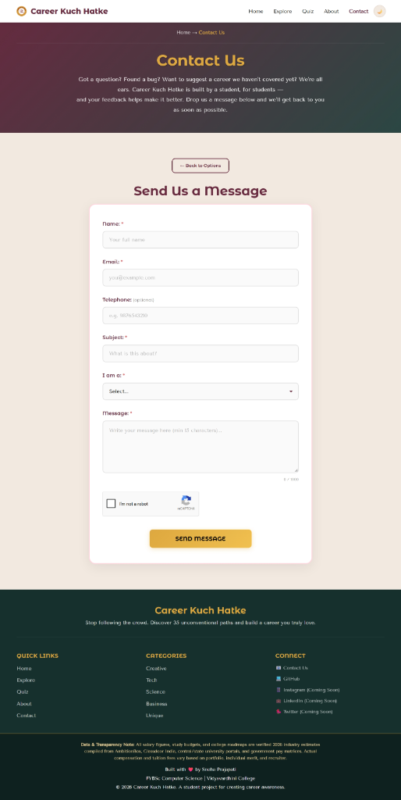

# ==============================================================================

# PROJECT DOCUMENTATION REPORT (TOTAL 8 PAGES - FORMAL ACADEMIC FORMAT)

# (4 Pages of Project Documentation + 4 Pages of Full-Page Website Screenshots)

# ==============================================================================

<!-- ============================== PAGE 1 ============================== -->

# VIDYAVARDHINI’S

### ANNASAHEB VARTAK COLLEGE OF ARTS,

### KEDARNATH MALHOTRA COLLEGE OF COMMERCE,

### E. S. ANDRADES COLLEGE OF SCIENCE

#### DEPARTMENT OF COMPUTER SCIENCE

_(Affiliated to the University of Mumbai) • Vasai Road (West), Palghar • Academic Year 2025 – 2026_

---

## A FIELD PROJECT REPORT ON:

# CAREER KUCH HATKE

### _An Interactive Unconventional Career Guidance Web Platform with Administrative Management Portal_

| Metadata Field              | Value / Details                                                                                                    | Metadata Field              | Value / Details                 |
| :-------------------------- | :----------------------------------------------------------------------------------------------------------------- | :-------------------------- | :------------------------------ |
| **Candidate Name:**         | Sneha Prajapati                                                                                                    | **Institutional Roll No.:** | **89**                          |
| **Academic Class:**         | Second Year B.Sc. Computer Science                                                                                 | **Semester / Stream:**      | Semester III — Computer Science |
| **Course / Subject:**       | Field Project (Computer Science)                                                                                   | **Academic Session:**       | Academic Year 2025 – 2026       |
| **Live Application URL:**   | [https://career-kuch-hatke.infinityfreeapp.com](https://career-kuch-hatke.infinityfreeapp.com)                     |                             |                                 |
| **Source Code Repository:** | [https://github.com/snehaprajapati-dev/career-kuch-hatke](https://github.com/snehaprajapati-dev/career-kuch-hatke) |                             |                                 |

---

### 1.0 Introduction & Project Overview

#### 1.1 Abstract & Executive Summary

In the Indian educational system, over eighty percent of secondary and undergraduate students are funneled toward an extremely narrow cluster of traditional careers—principally Engineering, Medicine, Civil Services, or Banking. This conventional pressure results in rampant academic fatigue, high institutional dropout rates, and widespread career dissatisfaction, while emerging creative and technology sectors face an acute shortage of skilled practitioners.

**Career Kuch Hatke** is an interactive, mobile-responsive web platform engineered to resolve this guidance deficit. It curates **35+ verified unconventional career pathways** across Creative, Tech, Science, Business, and Unique disciplines. Beyond high-level career profiles, the platform provides students with authentic 2026 Indian salary benchmarks (starting packages through senior levels), safety-cushion degrees, accredited institutional roadmaps, an algorithmic aptitude assessment quiz, a persistent client-side bookmarking engine, and a specialized **"Talk to Your Parents"** conversational pitch generator with one-tap WhatsApp integration. Developed using **HTML5, CSS3, JavaScript (ES6+), PHP 8.2, and MySQL**, the project features a complete administrative backend and is deployed live via automated GitHub Actions CI/CD pipelines.

---

#### 1.2 Problem Statement & Motivation

1. **Information Asymmetry:** Reliable academic prerequisites and Indian salary figures for emerging professions (e.g., Ethical Hacker, UI/UX Designer, Drone Pilot, Flavor Chemist, Space Mission Scientist) are scattered across fragmented foreign publications that fail to reflect Indian recruiter standards.
2. **The "Parental Resistance" Hurdle:** Indian students frequently encounter skepticism from parents who prioritize financial stability, predictable progression, and recognizable formal degrees.
3. **Absence of Accessible Assessment Tools:** Students lack beginner-friendly assessment tools that evaluate their natural problem-solving inclinations and match them to modern industry specializations.

---

#### 1.3 Project Objectives & Scope

- **Curated Knowledge Base:** Build comprehensive, verified roadmaps for 35+ non-traditional professions with transparent salary brackets, degree cushions, and realistic study budgets.
- **Client-Side Interactivity:** Implement zero-latency keyword search with synonym mapping, dynamic category filtering, and saved bookmarks using pure JavaScript without heavy external libraries.
- **Parental Alignment Mechanism:** Formulate customized 30-second conversational pitches containing verifiable industry packages for students to share directly via WhatsApp.
- **Full-Stack Form Processing:** Handle student feedback and community career suggestions through server-side PHP validation, sanitized database insertion, and an administrative review dashboard.
- **Production Deployment:** Establish continuous integration and deployment (CI/CD via GitHub Actions) to synchronize local developments directly with production Linux hosting.

<!-- Running Footer: Department of Computer Science • S.Y. B.Sc. CS • Field Project Documentation • Page 1 of 8 -->
<!-- ============================ END OF PAGE 1 ============================ -->

<div style="page-break-after: always;"></div>

<!-- ============================== PAGE 2 ============================== -->

### 2.0 System Architecture & Module Specifications

#### 2.1 System Architecture & Data Flow

```text
+-------------------------------------------------------------------------------+
|                             CLIENT-SIDE LAYER (BROWSER)                       |
|   HTML5 (Semantic Web) | CSS3 (Grid & Flexbox Layouts) | JavaScript (ES6+)    |
|   - Real-Time Keyword & Synonym Search     - Aptitude Assessment Quiz Engine   |
|   - Multi-Category Domain Filtering        - LocalStorage Bookmarks Engine     |
+-------------------------------------------------------------------------------+
                                      |
                           HTTP / HTTPS GET & POST
                                      |
+-------------------------------------------------------------------------------+
|                      APPLICATION SERVER (APACHE / PHP 8.2)                    |
|   - Request Routing & Form Handlers (contact-process.php, suggestion.php)     |
|   - Administrative Back-Office (login.php, dashboard.php, export.php)         |
|   - Security Layer: Input Sanitization, XSS Neutralization, Session Auth      |
+-------------------------------------------------------------------------------+
                                      |
                            SQL Query Execution
                                      |
+-------------------------------------------------------------------------------+
|                         DATABASE LAYER (MySQL 8.x)                            |
|   - Table: contacts (id, name, email, message, submitted_at)                  |
|   - Table: career_suggestions (id, name, email, career_title, description)    |
+-------------------------------------------------------------------------------+
```

#### 2.2 Technology Stack Specifications

| Architecture Layer         | Technology Selected           | Implementation Details                                                                                                  |
| :------------------------- | :---------------------------- | :---------------------------------------------------------------------------------------------------------------------- |
| **Frontend Structure**     | **HTML5 Semantic**            | Structured elements (`<header>`, `<nav>`, `<main>`, `<section>`, `<footer>`) for clean DOM hierarchy and accessibility. |
| **Styling & Presentation** | **CSS3 (Grid & Flexbox)**     | CSS Custom Properties (Variables), mobile-first media queries, anti-flash Dark/Light mode theme persistence.            |
| **Client Scripting**       | **Vanilla JavaScript (ES6+)** | DOM event listeners, synonym keyword dictionary, quiz vector scoring engine, browser Web Storage API (`localStorage`).  |
| **Backend Processing**     | **PHP 8.2 (Procedural)**      | Asynchronous POST handling, data sanitization (`htmlspecialchars`), admin session authentication.                       |
| **Relational Database**    | **MySQL Relational DB**       | Normalized relational database storing student contact inquiries and community career suggestions.                      |
| **Deployment & CI/CD**     | **GitHub Actions & FTPS**     | Automated continuous deployment pipeline triggered on every commit to the GitHub `main` branch.                         |

---

#### 2.3 Functional Module Breakdown

The application comprises **6 primary user-facing modules** and an integrated **Administrative Portal**:

1. **Home Portal (`index.html`):** Hero banner with primary CTAs, comparative "Rat Race vs. Hatke Career" problem-solution section, featured career showcase, and persistent theme switcher.
2. **Career Exploration Grid (`explore.html`):** Grid layout featuring 35 standardized equal-height career cards. Includes real-time Category Filter Pills (Creative, Tech, Science, Business, Unique), dedicated Bookmarked filter, and an instant keyword search bar with clear toggle.
3. **Dynamic Career Roadmap Engine (`career-detail.html`):** Single-page dynamic template driven by URL parameters (e.g., `?career=ui-ux-designer`). Features 10 modular sections: Quick Facts, What They Actually Do, Career Trajectory, Accredited Colleges, Degree Safety Net, and "Talk to Your Parents" pitch generator with an Action Toolbar (Expand All, Save PDF, Share, Bookmark).
4. **Career Aptitude Quiz (`quiz.html`):** Interactive self-assessment evaluating problem-solving instincts, creativity, and analytical traits. Employs a client-side vector weighting algorithm to display percentage matches and targeted career recommendations.
5. **About & Transparency (`about.html`):** Documents the project vision, developer biography, data collection methodologies, and authoritative citation sources.
6. **Contact & Suggestions (`contact.html`):** Interactive user portal supporting both feedback inquiries and student-submitted career suggestions with client and server validation.
7. **Admin Management Module (`admin/`):** Restricted back-office consisting of session-authenticated login (`login.php`), metrics dashboard (`dashboard.php`), submission review tables (`contacts.php`, `suggestions.php`), item deletion (`delete.php`), and CSV export for Excel analysis (`export.php`).

<!-- Running Footer: Department of Computer Science • S.Y. B.Sc. CS • Field Project Documentation • Page 2 of 8 -->
<!-- ============================ END OF PAGE 2 ============================ -->

<div style="page-break-after: always;"></div>

<!-- ============================== PAGE 3 ============================== -->

### 3.0 Technical Methodology & Key Implementations

#### 3.1 Smart Synonym Search & Live DOM Filtering (`js/script.js`)

Students commonly search using conversational terms rather than formal corporate job designations. To solve this, the search engine utilizes a comprehensive synonym mapping dictionary that evaluates student queries against pre-indexed career keywords:

```javascript
const searchKeywordsMap = {
  "ethical-hacker": [
    "coding",
    "security",
    "hacking",
    "cyber",
    "python",
    "linux",
    "bug bounty",
  ],
  "food-stylist": [
    "food",
    "cooking",
    "styling",
    "photography",
    "chef",
    "culinary",
    "baking",
  ],
  "ui-ux-designer": [
    "design",
    "figma",
    "app",
    "website",
    "interface",
    "wireframe",
    "product",
  ],
};
```

On every keystroke, the algorithm evaluates career titles, taglines, categories, and synonym arrays. Unmatched card elements are marked with `.is-hidden` and hidden with `display: none !important;`, instantly recalculating the active count badge without reloading the page.

#### 3.2 Client-Side Bookmark State Persistence (`localStorage`)

To allow students to curate a personalized list of favorite careers without requiring account creation friction, a zero-latency storage architecture was implemented:

- **Data Model:** Saved career identifiers are stored as a JSON array under the key `'ckh_bookmarks'` in browser `localStorage`.
- **Dynamic UI Synchronization:** Tapping the bookmark button on any card toggles the slug in storage, transitions the button to an active state, increments the `#bookmarkCount` badge, and presents a floating notification (_"Career saved to bookmarks"_).
- **Smart Empty State:** When the Bookmarked filter is selected with zero saved careers, a custom prompt appears with a one-tap **"View All Careers"** reset button.

#### 3.3 Parental Communication Logic & WhatsApp Integration

To address parental skepticism, `career-detail.js` dynamically aggregates verified starting salaries, safety-cushion degree alternatives, and top Indian institutions into a structured WhatsApp message:

```javascript
const shareUrl =
  "https://career-kuch-hatke.infinityfreeapp.com/career-detail.html?career=" +
  careerId;
const pitchText =
  `Namaste Mummy/Papa, I was exploring verified career roadmaps on Career Kuch Hatke:\n\n` +
  `Career: ${career.name}\nSalary Potential: ${career.quickFacts.salary}\n` +
  `Degree Safety Cushion: ${career.quickFacts.degree}\n` +
  `Top Institutes: ${career.indianColleges.slice(0, 2).join(", ")}\n\n` +
  `Please check the complete roadmap here: ${shareUrl}`;
window.open(
  "https://api.whatsapp.com/send?text=" + encodeURIComponent(pitchText),
  "_blank",
);
```

#### 3.4 Server-Side PHP Validation & Input Sanitization

All incoming POST data is rigorously cleansed before database interaction to prevent Cross-Site Scripting (XSS) and SQL injection vulnerabilities:

```php
$name    = htmlspecialchars(strip_tags(trim($_POST['name'])), ENT_QUOTES, 'UTF-8');
$email   = filter_var(trim($_POST['email']), FILTER_SANITIZE_EMAIL);
$message = htmlspecialchars(strip_tags(trim($_POST['message'])), ENT_QUOTES, 'UTF-8');

if (!filter_var($email, FILTER_VALIDATE_EMAIL)) {
    die(json_encode(["status" => "error", "message" => "Please provide a valid email."]));
}
```

#### 3.5 Anti-Flash Theme Persistence Architecture

To eliminate the jarring white flash of unstyled content when reloading dark mode pages, a micro-script executes synchronously inside the document `<head>` before any stylesheet is parsed:

```javascript
(function () {
  var s = localStorage.getItem("ckh_theme");
  if (s === "dark") document.documentElement.setAttribute("data-theme", "dark");
})();
```

<!-- Running Footer: Department of Computer Science • S.Y. B.Sc. CS • Field Project Documentation • Page 3 of 8 -->
<!-- ============================ END OF PAGE 3 ============================ -->

<div style="page-break-after: always;"></div>

<!-- ============================== PAGE 4 ============================== -->

### 4.0 Database Design, Testing & Conclusion

#### 4.1 Database Design & Table Schema Specifications

The MySQL relational backend comprises two tables supporting inquiries and user submissions:

| Table Name                                                         | Field Identifier                                       | Data Type                                                            | Constraints & Purpose                                                                                                               |
| :----------------------------------------------------------------- | :----------------------------------------------------- | :------------------------------------------------------------------- | :---------------------------------------------------------------------------------------------------------------------------------- |
| **contacts**<br><small>(Student inquiries)</small>                 | `id`<br>`name`, `email`<br>`message`<br>`submitted_at` | `INT(11)`<br>`VARCHAR(100)`, `VARCHAR(150)`<br>`TEXT`<br>`TIMESTAMP` | `PRIMARY KEY, AUTO_INCREMENT`<br>`NOT NULL, Validated email format`<br>`Sanitized inquiry text body`<br>`DEFAULT CURRENT_TIMESTAMP` |
| **career_suggestions**<br><small>(Crowd-sourced proposals)</small> | `id`<br>`career_title`, `category`<br>`description`    | `INT(11)`<br>`VARCHAR(150)`, `VARCHAR(50)`<br>`TEXT`                 | `PRIMARY KEY, AUTO_INCREMENT`<br>`Proposed career title and primary domain`<br>`Student explanation of career viability`            |

---

#### 4.2 Testing, Verification & Quality Assurance Matrix

| Verification Domain             | Testing Procedure                                                               | Outcome & Status                                                        |
| :------------------------------ | :------------------------------------------------------------------------------ | :---------------------------------------------------------------------- |
| **Cross-Browser Compatibility** | Audited on Google Chrome 120+, Firefox 122+, MS Edge, and Safari iOS.           | **Passed:** Consistent flex/grid layout across all engines.             |
| **Mobile Responsiveness**       | Simulated viewports from 360px (mobile) to 768px (tablet) and 1440px (desktop). | **Passed:** Equalized card heights, centered footer, touch tap targets. |
| **Syntax & Runtime Integrity**  | Validated via Node.js compiler (`node -c script.js`).                           | **Passed:** Zero syntax errors or uncaught promise rejections.          |
| **Cache Invalidation Strategy** | Query version parameters (`?v=6.0`) assigned to all stylesheet and script tags. | **Passed:** Instant updates on client devices without stale cache.      |

---

#### 4.3 Live Deployment Pipeline & CI/CD Workflow

1. **Local Development:** Created and validated on an Apache/PHP/MySQL stack using XAMPP on Windows (`http://localhost:8080/`).
2. **Version Control:** Source code managed with Git and synchronized to GitHub (`origin/main`).
3. **Continuous Deployment (GitHub Actions):** Configured `.github/workflows/deploy.yml` to securely authenticate via repository secrets (`FTP_SERVER`, `FTP_USERNAME`, `FTP_PASSWORD`) and trigger automated FTPS synchronization to InfinityFree production servers on every push.

---

#### 4.4 Project Limitations & Future Scope

- **Current Limitations:** Career content is currently managed via static client-side JavaScript structures rather than a headless database CMS. Bookmarks are tied to device `localStorage`.
- **Future Enhancements:**
  1. **Cloud-Synced Student Accounts:** User authentication with hashed passwords (`password_hash`) to synchronize bookmarks across devices.
  2. **Direct Mentorship Scheduling:** Calendar booking integration for students to schedule 1-on-1 counseling calls with working domain professionals.
  3. **AI Career Chatbot:** LLM integration to answer student queries regarding college entrance cutoffs, portfolio requirements, and job outlooks.

---

#### 4.5 Conclusion & Academic References

The **Career Kuch Hatke** project fulfills all academic requirements of the BSc Computer Science Field Project curriculum. It demonstrates a production-grade fusion of semantic HTML5, responsive CSS3 Grid and Flexbox, dynamic JavaScript event handling, client-side persistence, and secure PHP/MySQL backend administration. By addressing an authentic societal dilemma in the Indian academic landscape, the project provides a practical, high-utility resource for the student community.

**Academic References:**

1. Glassdoor India & AmbitionBox: 2026 Indian Industry Compensation Reports.
2. UGC & AICTE: Institutional Accreditations, Program Structures & Degree Guidelines.
3. MDN Web Docs: HTML5 Semantics, CSS Grid & Web Storage APIs.

<!-- Running Footer: Department of Computer Science • S.Y. B.Sc. CS • Field Project Documentation • Page 4 of 8 -->
<!-- ============================ END OF PAGE 4 ============================ -->

<div style="page-break-after: always;"></div>

<!-- ============================== PAGE 5 ============================== -->

### 5.0 Platform User Interface &mdash; Module 1: Home Portal

The **Home Page (`index.html`)** acts as the central introductory gateway to the platform. It features a bold hero headline addressing career anxiety, direct action callouts, the comparative "Rat Race vs. Hatke Career" problem-solution dilemma matrix, and categorical exploration pills.



**Figure 5.1: Home Page Interface (`index.html`)** — Demonstrates the primary landing view, interactive "Rat Race vs. Hatke Career" comparative statistics (93% career awareness gap), 5 domain category spotlights (Creative, Tech, Science, Business, Unique), and fully responsive navigation with Dark/Light theme toggle.

<!-- Running Footer: Department of Computer Science • S.Y. B.Sc. CS • Field Project Documentation • Page 5 of 8 -->
<!-- ============================ END OF PAGE 5 ============================ -->

<div style="page-break-after: always;"></div>

<!-- ============================== PAGE 6 ============================== -->

### 6.0 Platform User Interface &mdash; Module 2: Career Roadmap Detail

The **Career Roadmap Engine (`career-detail.html`)** dynamically constructs an in-depth vocational blueprint from URL query parameters. The template organizes authentic 2026 industry packages, accredited colleges, degree safety cushions, and parental conversation pitches.



**Figure 6.1: Dynamic Career Roadmap Engine (`career-detail.html?career=ai-prompt-engineer`)** — Illustrates the modular career guide for an _AI Prompt Engineer_, detailing verified starting-to-senior salary brackets, step-by-step educational milestones, accredited Indian colleges, degree cushions, and the one-tap 30-Second WhatsApp Parent Pitch generator.

<!-- Running Footer: Department of Computer Science • S.Y. B.Sc. CS • Field Project Documentation • Page 6 of 8 -->
<!-- ============================ END OF PAGE 6 ============================ -->

<div style="page-break-after: always;"></div>

<!-- ============================== PAGE 7 ============================== -->

### 7.0 Platform User Interface &mdash; Module 3: About Us & Research

The **About Us & Transparency Portal (`about.html`)** outlines the foundational research motivation, statistical realities of career selection pressures in India, the developer's academic background, and future platform roadmap milestones.



**Figure 7.1: About Us & Research Transparency Portal (`about.html`)** — Highlights the academic narrative and personal motivation of developer Sneha Prajapati (Roll No. 89), contextualized with national student career surveys (72% career mismatch rate), core platform values, and authorized citation references.

<!-- Running Footer: Department of Computer Science • S.Y. B.Sc. CS • Field Project Documentation • Page 7 of 8 -->
<!-- ============================ END OF PAGE 7 ============================ -->

<div style="page-break-after: always;"></div>

<!-- ============================== PAGE 8 ============================== -->

### 8.0 Platform User Interface &mdash; Module 4: Inquiries & Suggestions

The **Contact & Career Suggestion Portal (`contact.html`)** provides a full-stack communication interface enabling students and educators to submit general queries and propose new emerging vocational disciplines for editorial review.



**Figure 8.1: Student Inquiries & Career Proposal Form (`contact.html`)** — Displays the user feedback interface equipped with client-side regex input validation, responsive form controls, anti-spam safeguards, and asynchronous submission to the PHP/MySQL administrative backend.

<!-- Running Footer: Department of Computer Science • S.Y. B.Sc. CS • Field Project Documentation • Page 8 of 8 -->
<!-- ============================ END OF PAGE 8 ============================ -->
