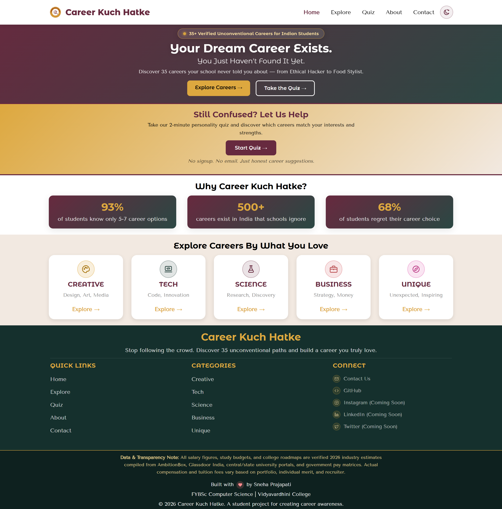
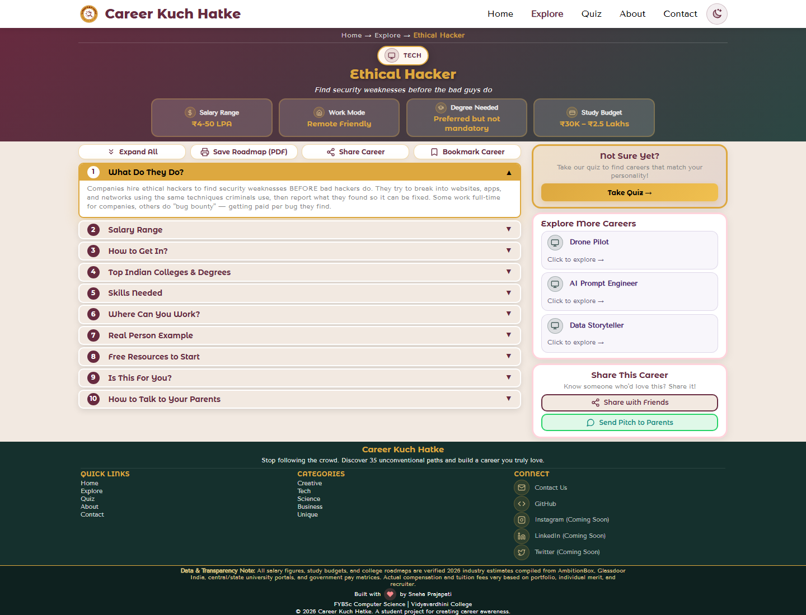
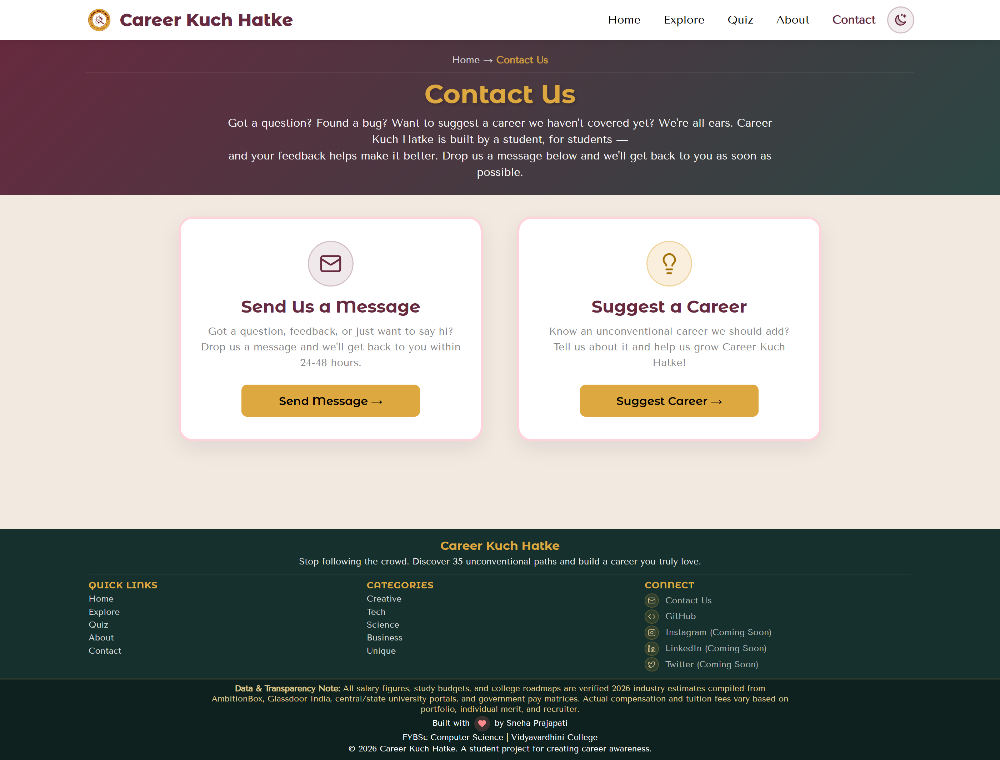

# ==============================================================================

# STANDARD FIELD PROJECT DOCUMENTATION REPORT (STRICTLY 10 PAGES TOTAL)

# ==============================================================================

<!-- ============================== PAGE 1 OF 10: TITLE PAGE ============================== -->

# VIDYAVARDHINI’S

### ANNASAHEB VARTAK COLLEGE OF ARTS,
### KEDARNATH MALHOTRA COLLEGE OF COMMERCE,
### E. S. ANDRADES COLLEGE OF SCIENCE

#### DEPARTMENT OF COMPUTER SCIENCE

_(Affiliated to the University of Mumbai) • Vasai Road (West), Dist. Palghar_

---

### A FIELD PROJECT REPORT ON

<p align="center">
  
</p>

# CAREER KUCH HATKE

_An Interactive Unconventional Career Guidance Web Platform with Administrative Management Portal_

Submitted in partial fulfillment of the requirements for the degree of  
**Bachelor of Science in Computer Science (S.Y. B.Sc. CS — Semester III)**  
**Academic Year:** 2026 – 2027

| Field                        | Details                                                   |
| :--------------------------- | :-------------------------------------------------------- |
| **Submitted By (Candidate)** | **Kumari Sneha Mahendra Prajapati**                       |
| **Class & Semester**         | **S.Y. B.Sc. Computer Science (Semester III)**            |
| **Institutional Roll No.**   | **89**                                                    |
| **Course / Subject**         | **Field Project (FP)**                                    |
| **Live Hosted Website**      | https://career-kuch-hatke.infinityfreeapp.com             |
| **GitHub Source Repository** | https://github.com/snehaprajapati-dev/career-kuch-hatke   |

| Subject Teacher / Project Guide | Head of the Department |
| :-----------------------------: | :--------------------: |

**Place:** Vasai Road (West) &nbsp;&nbsp;&nbsp;&nbsp;&nbsp;&nbsp;&nbsp;&nbsp;&nbsp;&nbsp; **Academic Year:** 2026 – 2027 &nbsp;&nbsp;&nbsp;&nbsp;&nbsp;&nbsp;&nbsp;&nbsp;&nbsp;&nbsp; **Page 1 of 10**

<div style="page-break-after: always;"></div>

<!-- ============================== PAGE 2 OF 10: INDEX ============================== -->

# VIDYAVARDHINI’S

### ANNASAHEB VARTAK COLLEGE OF ARTS, KEDARNATH MALHOTRA COLLEGE OF COMMERCE, E. S. ANDRADES COLLEGE OF SCIENCE

#### DEPARTMENT OF COMPUTER SCIENCE

## PROJECT INDEX / TABLE OF CONTENTS

**Project Title:** CAREER KUCH HATKE &bull; **Candidate:** Sneha Prajapati (Roll No. 89)

| Sr. No. | Topic / Section Title                                                                                                                                      |  Page No.   | Teacher's Signature |
| :-----: | :--------------------------------------------------------------------------------------------------------------------------------------------------------- | :---------: | :-----------------: |
|  **—**  | **Title Page & Project Overview**<br>_Official project cover page with website emblem, candidate metadata, and live deployment links_                      | **Page 1**  |                     |
| **1.0** | **Introduction to Website & Problem Statement**<br>_Executive summary, societal need, problem statement, and project objectives_                           | **Page 3**  |                     |
| **2.0** | **Introduction to Website: Core Webpage Modules**<br>_Target audience and detailed breakdown of all 7 website modules_                                     | **Page 4**  |                     |
| **3.0** | **Technologies Used & System Architecture**<br>_Client-server data flow diagram, technology stack table, and environment requirements_                     | **Page 5**  |                     |
| **4.0** | **Technologies Used: Implementation of CSS (Why & How)**<br>_Responsive CSS Grid/Flexbox layouts, custom variables, and dark/light themes_                 | **Page 6**  |                     |
| **5.0** | **Technologies Used: Implementation of PHP & MySQL Database**<br>_Backend form processing, XSS/SQL injection security, and database schema_                | **Page 7**  |                     |
| **6.0** | **Web Hosting, CI/CD Deployment & System Testing**<br>_Local XAMPP setup, InfinityFree cloud hosting, GitHub Actions CI/CD, and QA matrix_                 | **Page 8**  |                     |
| **7.0** | **Website Screenshots (Only 3 Core Modules)**<br>_Home page hero portal, dynamic career roadmap detail, and contact/suggestion portal_                     | **Page 9**  |                     |
| **8.0** | **References and Bibliography (with Conclusion & Scope)**<br>_Current limitations, future scope, academic conclusion, and bibliography citations_          | **Page 10** |                     |

**Student Declaration:** I hereby declare that this project documentation report of 10 pages represents authentic academic work completed by me for the B.Sc. Computer Science Field Project curriculum (Academic Year 2026–2027).  
**Candidate Signature:** Sneha Prajapati (Roll No. 89)

<!-- Running Footer: Department of Computer Science • S.Y. B.Sc. CS • Roll No. 89 • Page 2 of 10 -->
<div style="page-break-after: always;"></div>

<!-- ============================== PAGE 3 OF 10 ============================== -->

### 1.0 Introduction to Website & Problem Statement

#### 1.1 Project Title & Executive Summary

- **Project Title:** CAREER KUCH HATKE — An Interactive Unconventional Career Guidance Web Platform with Administrative Management Portal.
- **Live Hosted URL:** https://career-kuch-hatke.infinityfreeapp.com
- **Source Code Repository:** https://github.com/snehaprajapati-dev/career-kuch-hatke

In the Indian educational system, over eighty percent of secondary and undergraduate students are funneled toward an extremely narrow cluster of traditional vocations—predominantly Engineering, Medicine, Civil Services, or Banking. This restrictive focus results in intense academic fatigue, high college dropout rates, and widespread career dissatisfaction, while sunrise creative and technology sectors face an acute shortage of skilled talent.

**Career Kuch Hatke** is an interactive web platform engineered to eliminate this guidance deficit. It curates **35+ verified unconventional career pathways** across Creative, Tech, Science, Business, and Unique disciplines. The platform equips students with transparent 2026 Indian salary packages, safety-cushion degree alternatives, accredited institutional roadmaps, an algorithmic aptitude quiz, a client-side bookmarking system, and a specialized **"Talk to Your Parents"** conversational pitch generator with one-tap WhatsApp integration.

#### 1.2 Problem Statement & Motivation

1. **Information Asymmetry:** Reliable academic prerequisites, study budgets, and authentic Indian entry-level compensation figures for emerging professions (e.g., Ethical Hacker, UI/UX Designer, Drone Pilot, Food Stylist, Flavor Chemist) are scattered across fragmented foreign publications that fail to reflect Indian recruiting standards.
2. **The "Parental Resistance" Hurdle:** Indian students frequently encounter skepticism from family members who prioritize financial stability, predictable progression, and recognized degrees.
3. **Absence of Accessible Assessment Tools:** Secondary and college students lack beginner-friendly assessment tools that evaluate their natural problem-solving inclinations and match them to modern industry specializations.

#### 1.3 Project Objectives & Scope

- **Curated Knowledge Base:** Compile comprehensive, verified roadmaps for 35+ non-traditional vocations with realistic salary brackets, degree cushions, and institutional timelines.
- **Zero-Latency Client Interactivity:** Implement client-side real-time keyword search with synonym mapping, category domain filtering, and saved bookmarks using pure JavaScript without heavy external libraries.
- **Parental Alignment Facilitation:** Formulate customized 30-second conversational pitches containing verifiable industry packages that students can share with parents via WhatsApp.
- **Full-Stack Form Processing:** Handle student feedback and community career suggestions through server-side PHP validation, sanitized database insertion, and an administrative review dashboard.
- **Automated Production Deployment:** Establish continuous integration and deployment (CI/CD via GitHub Actions) to synchronize local developments directly with production Linux hosting.

<!-- Running Footer: Department of Computer Science • S.Y. B.Sc. CS • Roll No. 89 • Page 3 of 10 -->
<div style="page-break-after: always;"></div>

<!-- ============================== PAGE 4 OF 10 ============================== -->

### 2.0 Introduction to Website: Core Webpage Modules

#### 2.1 Platform Purpose & Target Audience

**Career Kuch Hatke** is conceptualized as an end-to-end guidance companion for Indian students in grades 10–12, undergraduates, and career switchers. Unlike generic educational directories, the website delivers actionable intelligence: not just "what the job is", but "how much it pays in India", "what safety degree keeps parents happy", "which colleges teach it", and "how to pitch it to Indian parents".

#### 2.2 Detailed Breakdown of Core Webpage Modules

The platform architecture comprises six distinct user-facing modules and a protected administrative back-office:

1. **Module 1 — Home Portal (`index.html`):** Introduces the platform mission ("Your Dream Career Exists"), provides immediate calls-to-action ("Explore Careers" and "Take Quiz"), highlights key Indian career-awareness statistics (93%, 500+, 68%), presents 5 interactive domain category cards, and includes an anti-flash dark/light theme switcher.
2. **Module 2 — Career Exploration Grid (`explore.html`):** Houses 35 standardized equal-height career cards. Features real-time Category Filter Pills (Creative, Tech, Science, Business, Unique), an instant keyword search bar with clear button and synonym evaluation, and a dedicated **"Bookmarked"** filter tab with friendly empty state.
3. **Module 3 — Dynamic Career Roadmap Engine (`career-detail.html`):** A parameterized single-page template driven by URL queries (e.g., `?career=ai-prompt-engineer`). Dynamically renders 10 structured sections: Quick Facts, Actual Duties, Career Trajectory, Accredited Indian Colleges, Degree Safety Net, and "Talk to Your Parents" pitch generator with action toolbar.
4. **Module 4 — Career Aptitude Assessment Quiz (`quiz.html`):** Interactive 8-question self-assessment evaluating analytical traits, creativity, and working preferences across 5 career domains through a client-side category-scoring algorithm that recommends top matching careers.
5. **Module 5 — About Us & Research Transparency (`about.html`):** Documents developer background (Sneha Prajapati, Roll No. 89), foundational motivation ("Why I Built This"), statistical realities of career selection pressures in India (72%, 3%, 65%), and the Version 1.0 future platform roadmap.
6. **Module 6 — Contact & Suggestion Portal (`contact.html`):** Dual-purpose communication portal allowing students to submit general inquiries and propose new emerging vocational paths for addition with client and server-side validation.
7. **Module 7 — Administrative Management Portal (`admin/`):** Restricted back-office consisting of session-authenticated login (`login.php`), metrics dashboard (`dashboard.php`), submission review tables (`contacts.php`, `suggestions.php`), item deletion (`delete.php`), and CSV export for Excel analysis (`export.php`).

<!-- Running Footer: Department of Computer Science • S.Y. B.Sc. CS • Roll No. 89 • Page 4 of 10 -->
<div style="page-break-after: always;"></div>

<!-- ============================== PAGE 5 OF 10 ============================== -->

### 3.0 Technologies Used & System Architecture

#### 3.1 System Architecture & Data Flow Diagram

```text
+-------------------------------------------------------------------------------+
|                             CLIENT-SIDE LAYER (BROWSER)                       |
|   HTML5 (Semantic Web) | CSS3 (Grid & Flexbox Layouts) | JavaScript (ES6+)    |
|   - Real-Time Keyword & Synonym Search     - Aptitude Assessment Quiz Engine   |
|   - Multi-Category Domain Filtering        - LocalStorage Bookmarks Engine     |
+-------------------------------------------------------------------------------+
                                      |
                           HTTP / HTTPS GET & POST
                                      |
+-------------------------------------------------------------------------------+
|                      APPLICATION SERVER (APACHE / PHP 8.2)                    |
|   - Request Routing & Form Handlers (contact-process.php, suggestion.php)     |
|   - Administrative Back-Office (login.php, dashboard.php, export.php)         |
|   - Security Layer: Input Sanitization, XSS Neutralization, Session Auth      |
+-------------------------------------------------------------------------------+
                                      |
                            SQL Query Execution
                                      |
+-------------------------------------------------------------------------------+
|                         DATABASE LAYER (MySQL 8.x)                            |
|   - Table: contact_messages (id, name, email, telephone, subject, user_type)  |
|   - Table: career_suggestions (id, career_name, career_reason, suggester_name)|
+-------------------------------------------------------------------------------+
```

#### 3.2 Technology Specifications Table

| Layer                  | Technology                        | Role & Implementation Purpose                                                                                                         |
| :--------------------- | :-------------------------------- | :------------------------------------------------------------------------------------------------------------------------------------ |
| **Frontend Markup**    | **HTML5 Semantic**                | Structured semantic elements (`<header>`, `<nav>`, `<main>`, `<section>`, `<footer>`) for accessibility and clean DOM tree traversal. |
| **Styling & Theme**    | **CSS3 (Grid & Flexbox)**         | Custom CSS variables, mobile-first responsive media queries, and anti-flash dark/light mode theme persistence.                        |
| **Client Scripting**   | **Vanilla JavaScript (ES6+)**     | DOM event listeners, keyword synonym dictionary, quiz scoring engine, and Web Storage API (`localStorage`) bookmarking.               |
| **Backend Processing** | **PHP 8.2 (Procedural)**          | Asynchronous POST parsing, data sanitization (`htmlspecialchars`, `filter_var`), and session-based administrator authentication.      |
| **Database Layer**     | **MySQL Relational DB**           | Normalized relational storage for student inquiries and community career submissions.                                                 |
| **Hosting & CI/CD**    | **InfinityFree & GitHub Actions** | Cloud Linux hosting with automated FTPS deployment pipeline triggered on git push to the main branch.                                 |

#### 3.3 Hardware & Software Environment Requirements

- **Development Hardware:** Standard x86-64 PC with Intel/AMD Multi-Core Processor, 8GB RAM, 100MB free disk storage.
- **Operating System & Tooling:** Windows 11, Visual Studio Code, XAMPP v8.2.12 (Apache 2.4, MariaDB 10.4, PHP 8.2).
- **Client Requirements:** Any modern standards-compliant web browser (Google Chrome 100+, Firefox 100+, Edge, Safari iOS).

<!-- Running Footer: Department of Computer Science • S.Y. B.Sc. CS • Roll No. 89 • Page 5 of 10 -->
<div style="page-break-after: always;"></div>

<!-- ============================== PAGE 6 OF 10 ============================== -->

### 4.0 Technologies Used: Implementation of CSS (Why & How)

#### 4.1 Why CSS was Implemented

Modern web applications demand an intuitive, visually engaging, and responsive interface that adapts seamlessly across smartphones, tablets, laptops, and desktop displays. Pure HTML produces unstyled, linear documents inadequate for structured career guidance. CSS3 was implemented to achieve:

- **Responsive Multi-Column Grids:** Displaying 35 career options requires dynamic multi-column layouts on desktop that gracefully collapse into a single touch-friendly column on mobile devices.
- **Equalized Card Heights:** In exploration grids, varying text length across careers causes uneven card heights. CSS Flexbox was implemented to ensure cards maintain identical vertical height across rows.
- **Accessible Color Contrast & Theme Support:** Implementation of Dark and Light modes reduces eye strain during prolonged reading and respects user operating system preferences.
- **Visual Affordance & Micro-Interactions:** Subtle hover states, smooth transitions, and glowing bookmark pills provide instant tactile feedback without cognitive overload.

#### 4.2 How CSS was Structured and Implemented

The styling architecture follows modular separation across distinct CSS files:

- **Global Design Tokens (`css/style.css`):** Defined using CSS Custom Properties (Variables) on the `:root` selector (e.g., `--bg-primary`, `--text-primary`, `--accent-purple`, `--card-border`) allowing instantaneous theme switching by toggling a single `data-theme="dark"` attribute on the root HTML element.
- **Modular Component Styles:** Dedicated stylesheets isolate component boundaries: `explore.css` manages filters and card grids; `career-detail.css` styles roadmap accordions and the parent pitch box; `quiz.css` handles progress indicators.
- **Strict Card Filtering Rule:** To resolve card filtering conflicts where flex cards remained visible, a strict utility class was implemented: `.career-card.is-hidden { display: none !important; }`.

```css
/* Equal Height Flexbox Card Architecture (css/explore.css) */
.career-card {
  display: flex !important;
  flex-direction: column;
  height: 100%;
  background: var(--bg-card);
  border: 1px solid var(--border-color);
  border-radius: 12px;
  transition:
    transform 0.2s ease,
    box-shadow 0.2s ease;
}
.career-card-content {
  flex-grow: 1; /* Automatically expands to equalize card heights across rows */
}
.career-card.is-hidden {
  display: none !important; /* Overrides flex display when card is filtered out */
}
```

<!-- Running Footer: Department of Computer Science • S.Y. B.Sc. CS • Roll No. 89 • Page 6 of 10 -->
<div style="page-break-after: always;"></div>

<!-- ============================== PAGE 7 OF 10 ============================== -->

### 5.0 Technologies Used: Implementation of PHP & Database

#### 5.1 Why PHP and MySQL were Implemented

Client-side technologies (HTML, CSS, JavaScript) execute entirely within the user's browser and cannot securely persist data across sessions or protect confidential back-office records. PHP and MySQL were implemented for:

- **Server-Side Form Processing:** Student inquiries and career suggestions submitted on `contact.html` must be received, parsed, validated, and stored permanently on the server.
- **Defense Against Malicious Injections:** Client-side validation can be bypassed by disabling JavaScript. Server-side PHP sanitizes all inputs against Cross-Site Scripting (XSS) and SQL injection.
- **Administrative Access Control:** An administrative portal requires protected session authentication (`session_start()`) so only authorized faculty can view incoming messages.

#### 5.2 How PHP and MySQL were Implemented

PHP 8.2 handles POST requests via parameterized prepared statements, verifying Google reCAPTCHA v2 tokens and redirecting with status query flags. The MySQL database comprises two normalized tables:

| Table Name                                                     | Field Identifier                                                  | Data Type                                                              | Constraints & Purpose                                                                                                            |
| :------------------------------------------------------------- | :---------------------------------------------------------------- | :--------------------------------------------------------------------- | :------------------------------------------------------------------------------------------------------------------------------- |
| **contact_messages**<br><small>Student inquiries</small>       | `id`<br>`name`, `email`, `telephone`<br>`subject`, `user_type`<br>`message`, `status` | `INT(11)`<br>`VARCHAR(100)`, `VARCHAR(150)`<br>`VARCHAR(100)`, `VARCHAR(50)`<br>`TEXT`, `VARCHAR(20)` | `PRIMARY KEY, AUTO_INCREMENT`<br>`NOT NULL, Validated contact details`<br>`Inquiry subject & role`<br>`Sanitized message body` |
| **career_suggestions**<br><small>Community suggestions</small> | `id`<br>`career_name`, `suggester_name`<br>`career_reason`, `status` | `INT(11)`<br>`VARCHAR(100)`, `VARCHAR(100)`<br>`TEXT`, `VARCHAR(20)` | `PRIMARY KEY, AUTO_INCREMENT`<br>`Proposed hatke career title & contributor`<br>`Explanation of uniqueness & review status`     |

```php
// Server-Side Sanitization & Prepared Statement Handler (php/contact-process.php)
$name      = htmlspecialchars(trim($_POST["name"]));
$email     = htmlspecialchars(trim($_POST["email"]));
$telephone = isset($_POST["telephone"]) ? htmlspecialchars(trim($_POST["telephone"])) : '';
$subject   = htmlspecialchars(trim($_POST["subject"]));
$i_am      = htmlspecialchars(trim($_POST["i_am"]));
$message   = htmlspecialchars(trim($_POST["message"]));

$sql  = "INSERT INTO contact_messages (name, email, telephone, subject, user_type, message, status) ";
$sql .= "VALUES (?, ?, ?, ?, ?, ?, 'unread')";
$stmt = $conn->prepare($sql);
$stmt->bind_param("ssssss", $name, $email, $telephone, $subject, $i_am, $message);
if ($stmt->execute()) { header("Location: ../contact.html?success=contact"); }
```

<!-- Running Footer: Department of Computer Science • S.Y. B.Sc. CS • Roll No. 89 • Page 7 of 10 -->
<div style="page-break-after: always;"></div>

<!-- ============================== PAGE 8 OF 10 ============================== -->

### 6.0 Web Hosting, CI/CD Deployment & System Testing

#### 6.1 Local XAMPP Environment & Cloud Hosting (InfinityFree)

- **Local Development (XAMPP):** Apache Web Server on port `8080` and MariaDB/MySQL on port `3306` (phpMyAdmin) were used to test PHP form handlers, prepared statements, and UI responsiveness locally.
- **Production Cloud Hosting (InfinityFree):** Deployed to Linux-based Apache hosting with PHP 8.2 and remote MySQL at `https://career-kuch-hatke.infinityfreeapp.com`, configured via `.htaccess` for compression and caching.
- **Automated CI/CD Pipeline (GitHub Actions):** Every `git push` to `main` on GitHub (`snehaprajapati-dev/career-kuch-hatke`) triggers `.github/workflows/deploy.yml`, which securely syncs files to the live server via FTPS using encrypted secrets.

```yaml
# GitHub Actions CI/CD Pipeline (.github/workflows/deploy.yml)
name: Deploy to InfinityFree
on: { push: { branches: [main] } }
jobs:
  web-deploy:
    runs-on: ubuntu-latest
    steps:
      - uses: actions/checkout@v3
      - name: Automated FTPS Sync
        uses: SamKirkland/FTP-Deploy-Action@v4.3.4
        with:
          server: ${{ secrets.FTP_SERVER }}
          username: ${{ secrets.FTP_USERNAME }}
          password: ${{ secrets.FTP_PASSWORD }}
          server-dir: htdocs/
```

#### 6.2 System Testing & Quality Assurance Matrix

| Testing Domain                  | Verification Procedure                                                                    | Outcome & Status                                                        |
| :------------------------------ | :---------------------------------------------------------------------------------------- | :---------------------------------------------------------------------- |
| **Cross-Browser Compatibility** | Audited on Google Chrome 120+, Mozilla Firefox 122+, Edge, and Safari iOS.                | **Passed:** Consistent grid/flex alignments and theme variables.        |
| **Mobile Responsiveness**       | Simulated viewports from 360px (mobile) to 768px (tablet) and 1440px (desktop).           | **Passed:** Equalized card heights and responsive navigation.           |
| **Search, Filter & Bookmarks**  | Tested synonym search, category filter persistence across breadcrumbs, and `localStorage`. | **Passed:** Instant filtering and persistent saved bookmarks.           |
| **Input Validation & Security** | Tested SQL injection and XSS payloads (`<script>`) in contact/suggestion forms.           | **Passed:** Inputs strictly sanitized via prepared statements.          |

<!-- Running Footer: Department of Computer Science • S.Y. B.Sc. CS • Roll No. 89 • Page 8 of 10 -->
<div style="page-break-after: always;"></div>

<!-- ============================== PAGE 9 OF 10 ============================== -->

### 7.0 Website Screenshots (Only 3 Core Modules)

The following three screenshots showcase the primary responsive user interfaces implemented across the **Career Kuch Hatke** web platform (captured live from production deployment):

#### Figure 7.1: Home Page Hero Interface (`index.html`)

Showcases responsive header navigation, core mission value proposition, and dual CTA pathways to career exploration and assessment.


#### Figure 7.2: Career Profile & Roadmap (`career-detail.html`)

Illustrates specialized career profile, 4-tier compensation metrics, educational requirements, and interactive action toolbar.


#### Figure 7.3: Contact & Suggestion Portal (`contact.html`)

Displays dual feedback channels for direct developer communication and student-driven career addition submissions.


<!-- Running Footer: Department of Computer Science • S.Y. B.Sc. CS • Roll No. 89 • Page 9 of 10 -->
<div style="page-break-after: always;"></div>

<!-- ============================== PAGE 10 OF 10 ============================== -->

### 8.0 References and Bibliography (with Conclusion & Future Scope)

#### 8.1 Current System Limitations & Future Scope

- **Current Limitations:** Career data resides in structured client-side JavaScript objects (`career-data.js`) rather than a database CMS, and bookmarks rely on device-specific browser `localStorage`.
- **Future Enhancements:** (1) Cloud-synchronized student accounts using PHP `password_hash()` authentication, (2) Direct 1-on-1 mentorship booking with domain professionals, and (3) AI Career Counselor chatbot for college cutoff and portfolio queries.

#### 8.2 Academic Conclusion

The **Career Kuch Hatke** project successfully fulfills all academic specifications stipulated for the B.Sc. Computer Science Field Project curriculum (Academic Year 2026–2027). It demonstrates a complete, production-grade synthesis of semantic HTML5, responsive CSS3 Grid and Flexbox, asynchronous JavaScript event handling, persistent browser storage, and secure PHP 8.2 / MySQL backend administration. By addressing an authentic career-awareness gap in the Indian student community, the platform delivers high social utility paired with technical competency.

#### 8.3 References and Bibliography

1. **Mozilla Developer Network (MDN Web Docs):** _HTML5 Semantic Elements, CSS3 Flexible Box & Grid Layout, and Web Storage API (`localStorage`/`sessionStorage`) Reference._ Available at: `https://developer.mozilla.org/`
2. **The PHP Group:** _Official PHP 8.2 Documentation — MySQLi Prepared Statements, Input Filtering (`filter_var`), Cross-Site Scripting Sanitization (`htmlspecialchars`), and Session Management._ Available at: `https://www.php.net/docs.php`
3. **MySQL / MariaDB Documentation:** _MySQL 8.0 Reference Manual — Relational Schema Design, Primary Keys, and InnoDB Storage Engine._ Available at: `https://dev.mysql.com/doc/`
4. **Duckett, Jon (2014):** _HTML & CSS: Design and Build Websites_ and _JavaScript & JQuery: Interactive Front-End Web Development._ John Wiley & Sons, Inc. (Reference Textbook).
5. **Nixon, Robin (2021):** _Learning PHP, MySQL & JavaScript: A Step-by-Step Guide to Creating Dynamic Websites (6th Edition)._ O'Reilly Media.
6. **Glassdoor India & AmbitionBox (2025–2026):** _Indian Industry Compensation & Salary Benchmark Reports for Emerging Technology, Design, Science, and Media Vocations._ Available at: `https://www.ambitionbox.com/`
7. **University Grants Commission (UGC), AICTE & NSDC India:** _National Higher Education Directories, NID/IIT/FTII/NFSU Curriculum Handbooks, and Skill India Vocational Frameworks._ Available at: `https://www.ugc.gov.in/`

<!-- Running Footer: Department of Computer Science • S.Y. B.Sc. CS • Roll No. 89 • Page 10 of 10 -->
